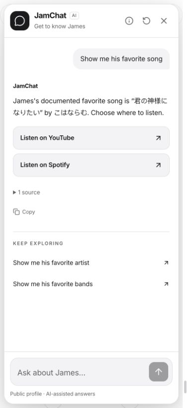
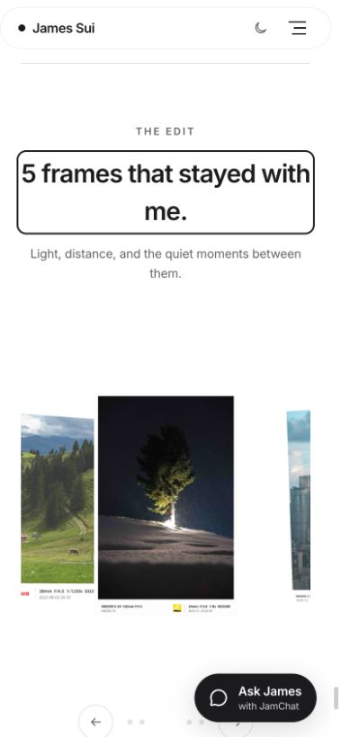

# JamChat navigation — 12 September 2026

Implemented locally; no commit, push or deployment.

## Visitor behavior

- “Direct me to James’s pictures” offers **View photography**.
- “Show his favoriate picture” explains that there are five curated picks, with **Explore James’s picks**. The count follows the actual featured-photo export; it is not a new claim that one picture is his favorite.
- “Where can I hear his favorite song?” offers **Listen on YouTube** and **Listen on Spotify**. Naming one service limits the actions to that service. Artist/band destinations are explicitly labelled search links.
- The approved Real Madrid / Cristiano Ronaldo era preference has source provenance in the favorites knowledge file, with official club and history links.
- Clear “take me there” and “that song” references reuse the session’s destination subject. Multiple subjects prompt clarification; unrelated topic changes do not reuse stale destinations or factual context.
- Internal links open only on click, collapse the widget, preserve draft/transcript, and focus the destination heading. External links open a separate tab and retain the conversation.

## Interfaces and maintenance

`POST /api/chat` adds optional `actions: string[]` destination IDs. The shared
`data/chat_destinations.json` resolves these IDs in Python and React; no model
output supplies an action URL. Old/malformed actions are safely omitted by the
client. Cards are separate from sources and follow-up suggestions.

After changing the catalog, restart the API and rebuild the frontend. New external
hosts also require updating the frontend destination allowlist and its tests. After
changing featured photos, run `node scripts/export_content.mjs` and the normal
knowledge-base refresh steps in README. If the export is unavailable, JamChat
explicitly cannot verify the selection and offers the gallery.

The `/photography#authors-choice` anchor works with React Router's base path,
lazy route rendering, same-page actions and browser history. Build-generated
JPEG thumbnail dimensions reserve space before images load. This fixes a mobile
layout shift discovered during verification that previously displaced the anchor.

No new runtime service, credential, external browsing, embed or autoplay was added.
Individual-photo links remain outside this version.

## Verification

- **264 backend tests passed**, including navigation wording, typos, photo-pick qualification, exact service selection, contextual ambiguity/reset, unrelated topic changes, unavailable facts, hidden-content refusal and mixed navigation/fact requests.
- **14 frontend tests passed**, including optional/invalid actions, allowed destinations, duplicate removal, existing client cancellation, and intrinsic geometry for every gallery thumbnail.
- Type checking, profile-fact validation and `git diff --check` passed.
- Root production build and `/about-me-bot-website/` base-path build passed. Root build generated the Pages 404 fallback.
- **22/22 existing live HTTP cases passed** against the final isolated API; results at `/tmp/jamchat-navigation-live.json`.
- Browser: no navigation before clicking; internal gallery and curated-picks links; correct base-path href; preserved draft and transcript; mobile collapse; destination heading focus; same-page anchor click; Back/Forward; direct anchor reload. After the image-dimension fix, mobile anchor arrival stayed about 72 pixels below the viewport top, below the fixed header.
- Browser: both listening cards rendered proper external link attributes. Clicking Spotify opened a new tab whose title identified **君の神様になりたい。** by **こはならむ**, leaving the website tab intact.

Physical devices and assistive-technology testing were not performed. External
service availability and regional playback restrictions remain outside the site's
control. The existing curated-link approach can be extended as more destinations
are approved.

