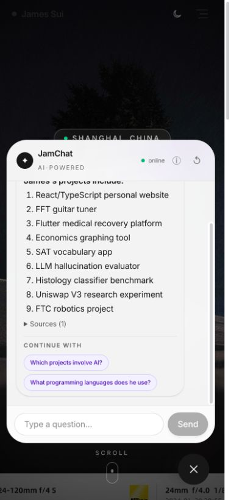
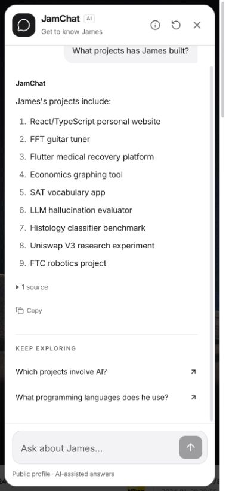
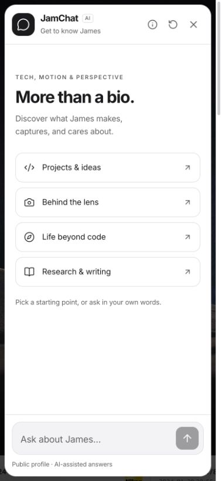
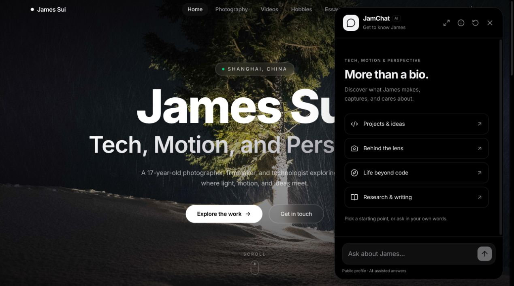
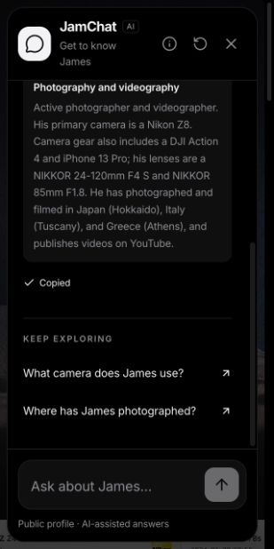

# JamChat experience review — 11 September 2026

1. Entry and welcome (01-before-welcome.png): working prompts and focus, but tiny supporting type, mixed emoji and sparkle marks, three perpetual decorative animations, and no explanatory launcher label. Build on the website's monochrome palette and sans typography.
2. Long answer on mobile (02-before-long-answer.png): answer loads, but automatic scrolling lands at the bottom, losing its introduction. Sources/suggestions are tiny and the composer is single-line. Preserve reading position, show the beginning of a new long answer, improve spacing and controls.

Code inspection adds: p5 is imported eagerly into the home-page bundle; its animation does not pause for a hidden browser document. The chat's JavaScript motion is not consistently disabled by reduced-motion preferences. Keyboard and assistive technology behavior require interaction tests, not screenshot claims.

## Implemented experience pass

1. **Discover and open — improved.** A labelled “Ask James / with JamChat” launcher leads to four contextual starting points. The existing website's palette and typography now carry through both themes. A consistent Lucide MessageCircle mark and icon family replace mixed decorative symbols; this is an interface identity, not a commissioned bespoke logo. Existing photography and generative artwork are retained.
2. **Ask and wait — improved.** Multiline, 500-character composer; Enter sends, Shift+Enter inserts a line, and IME composition is guarded. Loading feedback changes after eight seconds without claiming artificial progress. Connection failures show retry and health-check actions. Reset still cancels stale client requests and starts a new session.
3. **Read and explore — improved.** Roomier prose, semantic ordered/bulleted lists, headings, quotes, code and simple tables. Raw HTML is never interpreted. Links open with appropriate rel attributes. Full source excerpts and copy feedback are available. New long answers reveal their beginning; incoming content preserves the position of readers who have scrolled away. Closing and reopening preserves that position. Desktop expansion provides more reading space.
4. **Follow up — improved, bounded.** Bulleted ordinals now resolve alongside numbered items. A newly named subject such as Python no longer inherits guitar-learning context. Requests to shorten long lists show three existing items with an explicit omitted-item count, preserving surrounding qualifications and sources. This is conservative list condensation, not a general prose summarizer.
5. **Use across devices — improved; further device testing useful.** Verified 390×844 and 320×640 layouts, including a corrected scrollbar-related clipping issue. VisualViewport sizing accommodates available viewport height. Keyboard Escape restores launcher focus; the input has a visible focus outline. Chat transitions and the existing canvas respect reduced-motion preferences in code. The p5 library loads on approach to its section; the canvas pauses offscreen and in hidden documents, with pixel density capped at two and frame rate at 30.

## Verification

- `npm run typecheck`: passed.
- `npm test`: **10 passed**, covering the client lifecycle plus answer parsing and scroll thresholds.
- `.venv/bin/python -m pytest -q`: **239 passed**, including new follow-up, shorter-list and qualification-preservation regressions.
- `npm run build`: passed; GitHub Pages `404.html` fallback generated. This experience pass adds no deployment configuration changes; the workflow retains the existing API URL/base-path configuration. An additional local API-configured build was served through Vite preview and exercised in the browser.
- Existing live HTTP evaluation: **22/22 passed**, no false refusals or unexpected answers in those cases. Results for this run are in `/tmp/jamchat-experience-live.json`.
- Browser checks: welcome prompts, long-answer beginning, short-list request, source expansion, copy success, desktop expand/compact, About/back, new chat, both themes, 320-pixel containment, Shift+Enter and Escape/focus return. Stopping the isolated test API produced actionable connection feedback; restoring it and choosing Try again returned the camera answer successfully.
- Production output: Home chunk **10.74 kB**; deferred p5 chunk **1,067.95 kB** (269.63 kB gzip). The main entry is **393.46 kB** (127.63 kB gzip). Separating p5 improves the initial dependency path; these are build sizes, not measured field performance scores.
- `git diff --check`: passed. No audit reports were edited, no commits or pushes made, and no deployment performed.

## Remaining limits

This pass does not establish maximum possible quality or certify WCAG conformance. Physical iOS/Android keyboards, screen-reader announcements and OS reduced-motion behavior still merit real-device testing. Markdown support is intentionally a small safe subset, without nested-list or escaped-pipe support. General prose summarization and arbitrary ambiguous follow-ups remain bounded by retrieval, the public profile and the local model. Existing source/refusal policies and the exclusion of hidden projects remain in force.

## Accepted captures

All captures were taken and inspected during this pass. The two mobile project-list captures use the same 390×844 viewport and question; the new view preserves the introduction and gives answers and actions more space. Source/copy capture is at 320×640. Desktop dark capture demonstrates shared website styling.

